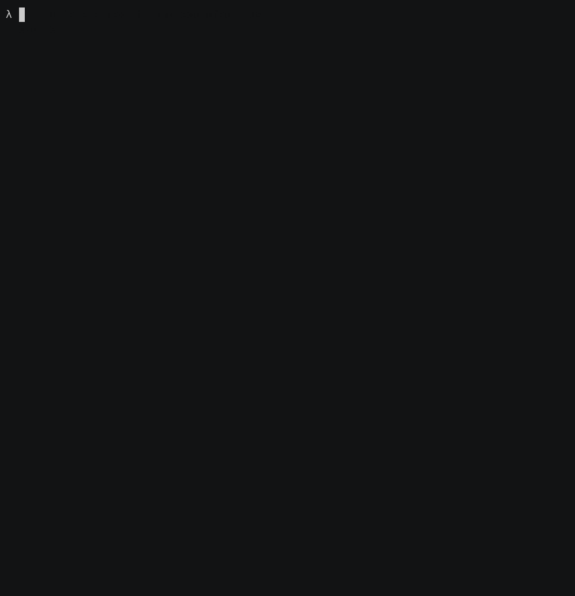

# phase cli

```
λ phase --help
Keep Secrets.

             /$$
            | $$
    /$$$$$$ | $$$$$$$   /$$$$$$   /$$$$$$$  /$$$$$$
   /$$__  $$| $$__  $$ |____  $$ /$$_____/ /$$__  $$
  | $$  \ $$| $$  \ $$  /$$$$$$$|  $$$$$$ | $$$$$$$$
  | $$  | $$| $$  | $$ /$$__  $$ \____  $$| $$_____/
  | $$$$$$$/| $$  | $$|  $$$$$$$ /$$$$$$$/|  $$$$$$$
  | $$____/ |__/  |__/ \_______/|_______/  \_______/
  | $$
  |__/

Commands:
  auth                              💻 Authenticate with Phase
  init                              🔗 Link your project with your Phase app
  run                               🚀 Run and inject secrets to your app
  shell                             🐚 Launch a sub-shell with secrets as environment variables
  secrets list                      📇 List all the secrets
  secrets get                       🔍 Fetch details about a secret in JSON
  secrets create                    💳 Create a new secret
  secrets update                    📝 Update an existing secret
  secrets delete                    🗑️  Delete a secret
  secrets import                    📩 Import secrets from a .env file
  secrets export                    🥡 Export secrets in a specific format
  dynamic-secrets list              📇 List dynamic secrets & metadata
  dynamic-secrets lease generate    ✨ Generate a lease (create fresh dynamic secret)
  dynamic-secrets lease get         🔍 Get leases for a dynamic secret
  dynamic-secrets lease renew       🔁 Renew a lease
  dynamic-secrets lease revoke      🗑️  Revoke a lease
  users whoami                      🙋 See details of the current user
  users switch                      🪄  Switch between Phase users, orgs and hosts
  users logout                      🏃 Logout from phase-cli
  users keyring                     🔐 Display information about the Phase keyring
  console                           🖥️  Open the Phase Console in your browser
  docs                              📖 Open the Phase CLI Docs in your browser
  completion                        ⌨️  Generate the autocompletion script for the specified shell

Flags:
  -h, --help      help for phase
  -v, --version   version for phase
```

## Features

- **End-to-end encryption** — secrets are encrypted client-side before leaving your machine
- **`phase run`** — inject secrets as environment variables into any command without code changes
- **`phase shell`** — launch a sub-shell (bash, zsh, fish, etc.) with secrets preloaded
- **Dynamic secrets** — generate short-lived credentials (e.g. database passwords) with automatic lease management (generate, renew, revoke)
- **Secret references** — reference secrets across environments and apps, resolved automatically at runtime
- **Personal overrides** — override shared secrets locally without affecting your team
- **Import / Export** — import from `.env` files; export to dotenv, JSON, YAML, TOML, CSV, XML, HCL, INI, Java properties, and more
- **Path-based organisation** — organise secrets in hierarchical paths for monorepos and microservices
- **Tagging** — tag secrets and filter operations by tag
- **Random secret generation** — generate hex, alphanumeric, 128-bit, or 256-bit keys on create or update
- **Multiple auth methods** — web-based login, personal access tokens, service account tokens, and AWS IAM identity auth
- **Multi-user & multi-org** — switch between Phase accounts, orgs, and self-hosted instances
- **OS keyring integration** — credentials stored in macOS Keychain, GNOME Keyring, or Windows Credential Manager
- **Multiple environments** — dev, staging, production, and custom environments with per-project defaults via `phase init`

## See it in action

[](asciinema-cli-demo)

## Installation

You can install Phase-CLI using curl:

```bash
curl -fsSL https://pkg.phase.dev/install.sh | bash
```

## Usage

### Login

Create an app in the [Phase Console](https://console.phase.dev) and copy appID and pss

```bash
phase auth
```

### Initialize

Link the phase cli to your project

```bash
phase init
```

### Import .env

Import and encrypt existing secrets and environment variables

```bash
phase secrets import .env
```

## List / view secrets

```bash
phase secrets list --show
```

## Run and inject secrets

`phase run // your run command`

Example:

```bash
phase run yarn dev
```

```bash
phase run go run
```

```bash
phase run npm start
```

## Development

### Prerequisites

- [Go](https://go.dev/dl/) 1.24 or later

### Project structure

```
src/
├── main.go          # Entrypoint
├── cmd/             # Cobra command definitions
├── pkg/
│   ├── config/      # Config file handling (~/.phase/, .phase.json)
│   ├── display/     # Output formatting (tree view, tables)
│   ├── errors/      # Error types
│   ├── keyring/     # OS keyring integration
│   ├── phase/       # Phase client helpers (auth, init)
│   ├── util/        # Misc utilities (color, spinner, browser)
│   └── version/     # Version constant
└── go.mod
```

### Run from source

```bash
cd src
go run main.go --help
```

### Build a binary

```bash
cd src
go build -o phase .
./phase --version
```

You can set the version at build time with `-ldflags`:

```bash
go build -ldflags "-X github.com/phasehq/cli/pkg/version.Version=2.0.0" -o phase .
```

### Run tests

```bash
cd src
go test ./...
```

### Install locally

Build and move the binary somewhere on your `$PATH`:

```bash
cd src
go build -o phase .
sudo mv phase /usr/local/bin/
phase --version
```